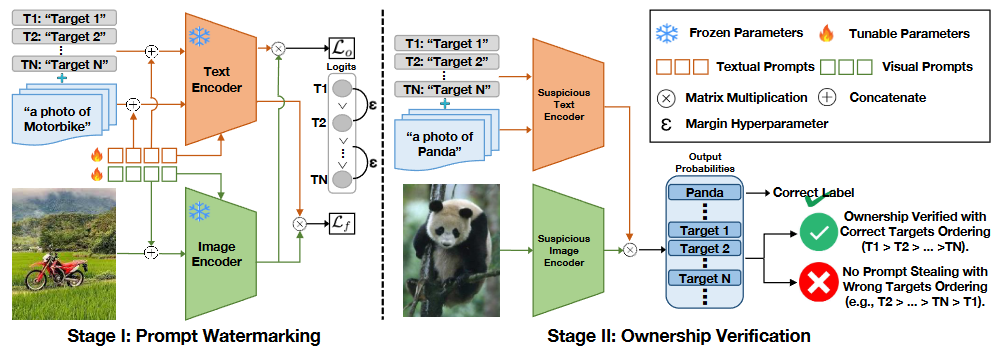
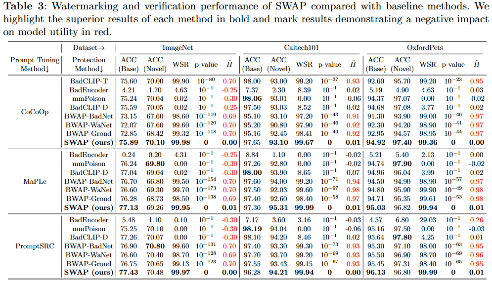

# SWAP: Towards Copyright Auditing of Soft Prompts via Sequential Watermarking.

---

## Introduction

This is the official implementation for our paper **["SWAP: Towards Copyright Auditing of Soft Prompts via Sequential Watermarking"](https://arxiv.org/abs/2511.04711)**. This paper is accepted by **International Journal of Computer Vision (IJCV)**.

---

## Overview



```text
SWAP/
├── clip/                     # CLIP model components
├── configs/                  # dataset and trainer configs
│   ├── datasets/
│   └── trainers/
├── datasets/                 # dataset registration / loading
├── docs/                     # installation, datasets, evaluation docs
├── scripts/                  # runnable bash scripts
│   ├── swap_promptsrc/
│   ├── swap_maple/
│   └── swap_cocoop/
├── trainers/                 # training logic for each method
├── train.py                  # main entrypoint
└── parse_test_res.py         # parse averaged test logs
```

---

## Getting Started

### 1) Environment

Recommended Python version: `3.8` (Ubuntu 20.04 tested in upstream docs).

```bash
conda create -y -n swap python=3.8
conda activate swap
pip install -r requirements.txt
```

Install PyTorch by following [pytorch.org](https://pytorch.org/) for your CUDA version.

### 2) Install Dassl.pytorch

```bash
git clone https://github.com/KaiyangZhou/Dassl.pytorch.git
cd Dassl.pytorch
pip install -r requirements.txt
python setup.py develop
cd ..
```

### 3) Prepare Datasets

Follow dataset preparation instructions in:

- [`docs/DATASETS.md`](docs/DATASETS.md)

Before running scripts, update the `DATA` variable in each script to your dataset root path.

---

## Running

All commands below should be executed at repository root.

### Base-to-Novel Training Scripts

```bash
# PromptSRC
bash scripts/swap_promptsrc/base2new_train.sh imagenet 1
# MaPLe
bash scripts/swap_maple/base2new_train_maple.sh imagenet 1
# CoCoOp
bash scripts/swap_cocoop/base2new_train.sh imagenet 1
```

---

## Main Results



---

## Acknowledgements

This codebase builds upon and adapts ideas from:

- [PromptSRC](https://github.com/muzairkhattak/PromptSRC)
- [MaPLe](https://github.com/muzairkhattak/multimodal-prompt-learning)
- [CoOp / Co-CoOp](https://github.com/KaiyangZhou/CoOp)
- [Dassl.pytorch](https://github.com/KaiyangZhou/Dassl.pytorch)

---

## Citation

```bibtex
@article{yang2026swapcopyrightauditingsoft,
      title={SWAP: Towards Copyright Auditing of Soft Prompts via Sequential Watermarking}, 
      author={Wenyuan Yang and Yichen Sun and Changzheng Chen and Zhixuan Chu and Jiaheng Zhang and Yiming Li and Dacheng Tao},
      journal={International Journal of Computer Vision},
      year={2026}
}
```

